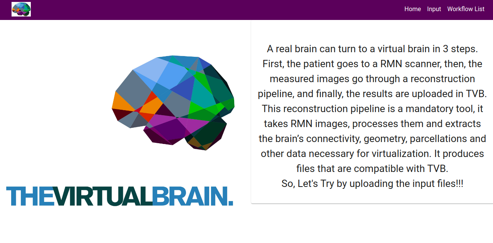

<h1 align="center">
  <br>
  <a href="http://www.amitmerchant.com/electron-markdownify"></a>
  <br>
  Web GUI for reconstruction pipeline
  <br>
</h1>

<p align="center">
  <a href="https://pegasus.isi.edu/downloads/">
    
  </a>
  <a href="https://groups.google.com/forum/#!forum/tvb-users ">
	  
</a>
  <a href="https://req.thevirtualbrain.org/">
      
  </a>
  <a href="https://www.thevirtualbrain.org/tvb/zwei/brainsimulator-software">
    
  </a>
</p>
<p>
<hr>

A real brain can turn to a virtual brain in 3 steps. First, the patient goes to a RMN scanner, then, the measured images go through a reconstruction pipeline, and finally, the results are uploaded in TVB.
<br/>
It provides the GUI for the reconstruction pipeline. This interface allow users to provide input data, choosing and editing the configurations, define the output structure, launch the workflow and monitor progress. We have integrated this GUI with our workflow engine <a href="https://pegasus.isi.edu/">Pegasus</a> in order to provide job status and job execution statistics.
</p>

**Note:- This WEB GUI is a Prototype. It's not fully automated. We have to start condor manually as described in the below steps. We can automate that part too. For this have a look on section `What we tried`. If you have any other ideas to do that part feel free to share.**

## How To Launch the GUI

For launching the GUI, Make sure you have npm and node installed on your local machine.
```bash
# Clone the web GUI repository and change the name `PUNITBATRA` by your GitHub Username.
$ git clone https://github.com/PUNITBATRA/tvb-recon.git

# Go into the repository
$ cd web

# Install all the dependencies
$ npm install

# Run the frontend
$ npm start

## Open another terminal for backend
# Run the backend
$ node server # or nodemon server

```
After doing all these steps `frontend` starts on http://localhost:3000/ and `server` runs on http://localhost:8000/.

<hr/>

## How To Use
At http://localhost:3000/ you can see the GUI and use all the components accordingly.


### Home Page 


On Home Page We have Header and Content. 

#### We have three Nav Link in Header `Home`, `Input` and `Workflow List`.
* Home Link is for rendering the Home Page.
* Input Link is for input the patient data files.
* Workflow List is for showing all the details of workflow (Successful,Running,Failed, Failing).

**Note:- All these Components can be used sequentially only. You have to first complete the input, configuration and manual part then only we can use Workflow List component.**


### Input Page


Input page requires the patients input data files. We can upload the patient data here and it search only the specific extension files in our local system. 
Once all the files are uploaded the `Red` Button color changes to `Blue` automatically and on click the upload button all the files are uploaded dynamically in the folder structure as `TVB_patients/TVB1/raw/mri`. 

**We have functionality for uploading the 4 patients data and all these files are uploaded in the respective folder dynamically. We can use the below slider (four dots) for uploading the other patients data.**

After uploading all the files we have a option for choosing the processing type. Currently TVB has all the working according to the `sequential` processing. If we want the `parallel` processing then we have to do the necessary changes.

**Note:- Parallel processing requires more computation so, we generally use sequential processing of data.**
 
Now we can click on `Proceed` button and it renders the configuration page.


### Configuration Page


In configuration page we have multiple inputs with default values whose value can also be edited as per the user choice.We can also use **`i`** button for more information about the properties.
<br/>
On click `Save Patient data` button all these data is saved in the `patient_flow.properties` file dynamically in the folder structure as TVB_patients/TVB1/configs.

**Properties which can't be edited by user are also present as default in the patient_flow.properties file.**
<br/>

**In the same way, we have functionality for choosing and editing the configuration properties for 4 patients. We can use the below slider (four dots) for different patients respectively.**


## Manual Part

### Docker image
We provide a docker image which gathers all the dependencies necessary for tvb-recon code to run.
The docker image can be found on docker hub at: **thevirtualbrain/tvb-recon**. Take it using the most recent tag, with:

```bash
# import docker image
$ docker pull thevirtualbrain/tvb-recon
```

In order to use tvb-recon GUI within the proposed docker image, you will need some details about its configurations and input data and it can be done by using the above GUI steps and after that you will have these folder structures for input and configurations as below in the web folder.

```
	TVB_patients 
		│
		├── TVB1 
		|     |
		|     └── raw  
		|	  |	    |
		|	  |     └── mri 
		|     |         |
		|	  |         ├── t1_input.nii.gz
		|     |         |
		|     |         ├── dwi_raw.nii
		|	  |         |
		|     |         ├── dwi.bvec
		|     |         |
		|     |         └── dwi.bval		
		|     |
        |     └── configs
    	|           |
		|	        └── patient_flow.properties 
    	└── TVB2 
		      |
		      └── raw  
			  |	    |
		 	  |     └── mri 
		      |         |
		 	  |         ├── t1_input.nii.gz
		      |         |
		      |         ├── dwi_raw.nii
		 	  |         |
		      |         ├── dwi.bvec
		      |         |
		      |         └── dwi.bval		
		      |
              └── configs
    	            |
			        └── patient_flow.properties 
```

(TVB1, TVB2, etc, being the ID of the patients. If your DWI data is not made of: dwi.nii + dwi.bvec + dwi.bval, let us know and we will tell you how to specify it differently.)


Now, you can run the tvb-recon docker image with the following command: 

``` bash
# To run the tvb-recon docker image
$ docker run -it -v your_path_to_TVB_patients/TVB_patients/:/home/submitter/data -v your_path_to_tvb_recon/tvb-recon/:/opt/tvb-recon thevirtualbrain/tvb-recon /bin/bash
``` 
(here you need to replace *your_path_to_TVB_patients* and *your_path_to_tvb_recon* with the paths of your local machine)

Now, you will be able to use bash commands inside the tvb-recon container. And here, you need to do the next steps:

``` bash 
# Run the following command and provide the sudo password: 123456
$ sudo condor_master

# Move to pegasus folder 
$ cd pegasus

# Run the pipeline by the following command. The “1” argument is the patient number you want to process. By specifying “1”, you choose to process TVB1.
$ python run_sequentially.py “1”
```
If everything is correct, some messages will be displayed. Look for the following flow of messages:   
```
*...  
Starting to process the subject: TVB1  
...  
2020.07.28 11:11:40.285 UTC:    Your workflow has been started and is running in the base directory:  
2020.07.28 11:11:40.293 UTC:     /home/submitter/pegasus/submit/submitter/pegasus/TVB-PIPELINE/run0001   
...  

The job that has been started has the id: 0001  
Starting to monitor the submit folder: /home/submitter/pegasus/submit/submitter/pegasus/TVB-PIPELINE/run0001 ...  
Checked at Thu, 28 Jul 2020 11:11:42 and monitord.done file was not generated yet!*

```

If the messages flow is not similar, let us know what is the error.

Once, you have started the workflow, you should see the ***configs*** folder on your local machine at path:<br> ***your_path_to_TVB_patients/TVB_patients/TVB1***
with all the other default configurations we need for a patient.

Later on, after some important steps have finished, you will also have an ***output*** folder inside:<br> ***your_path_to_TVB_patients/TVB_patients/TVB1***. 
Here is where all the output data will be stored, and of more interest will be the folders:
- **output/figs** (figures generated during different pipeline steps to check the quality of the data)
- **output/tvb** (files that are compatible with TVB and can be uploaded and used there)


We use the Pegasus workflow engine in order to automatize the pipeline steps. This tool will let you check the status of the workflow anytime.
In order to check the status of your current workflow:

``` bash 
# You can open a new terminal on the tvb-recon docker container with:
$ docker exec -i -t container_id /bin/bash

# Then run this command
$ pegasus-status -l /home/submitter/pegasus/submit/submitter/pegasus/TVB-PIPELINE/run0001

# To run the dashborad at https://localhost:5000/
$ pegasus-service

```

### How to check Workflow and Job Status

Now after following all these steps and running the pegasus-service command you can use the Workflow List component in the NavBar and it shows the list of all workflows with status,submit directory and timestamp.<br/>

### Workflow List Page


**Note:- The workflow list shown in the image is just for the reference according to the <a href="https://pegasus.isi.edu/documentation/tutorial.php">Pegasus official tutorial</a>.**

By clicking on these workflow labels we can check the details of respective jobs of the workflow.
<br/>

### Job List Page 


In this page we have five tables.
* For All the Jobs
* For Successful Jobs (GREEN COLOR)
* For Failed Jobs (RED COLOR)
* For Running Jobs (BLUE COLOR)
* For Failing Jobs (GRAY COLOR)

So, We can check the Job status along with other details. 

**Note:- The job list shown in the image is also just for the reference according to the <a href="https://pegasus.isi.edu/documentation/tutorial.php">Pegasus official tutorial</a>.**

## What we tried

To start condor automatically, we have changed the docker image of TVB-recon and TVB-recon software. We have used [andypohl/htcondor](https://hub.docker.com/r/andypohl/htcondor/dockerfile) docker image in TVB-recon software. This `andypohl/htcondor` docker image works on CentOS 7. So, we have changed the TVB-recon software and TVB-recon dockerfile commands according to CentOS 7 instructions and after building both the image, still result was unexpected means condor didn't started automatically.<br/>
For more information about the changed Dockerfile you can pull the docker images by using the command `docker pull thevirtualbrain/tvb-recon:GSOC`.


## Improvements

These are some of the improvements which can be done in future for making the Web GUI more user interactive.
* Automate the docker part by starting condor automatically inside docker too.
* Testing can also be done for the components and API part.
* Some code snippets can also be make more generalised in server file.
* As it's the initial version of the GUI, Many more features can be added in future. 

## Contributing

Contributions, issues and more feature requests are welcome! If you find any issue feel free to create.

## Contact

If you have any query, you can reach out to the contributor, maintainers and our community on [TVB-Jira](https://req.thevirtualbrain.org/secure/Dashboard.jspa) . Where you can ask questions and interact, join with us!

### Contributor
[Punit Batra](https://github.com/PUNITBATRA) [GSOC-2020]

### Maintainer
[Paula Popa](https://github.com/popaula937)

**Thanks!!! Contributions are welcome!**